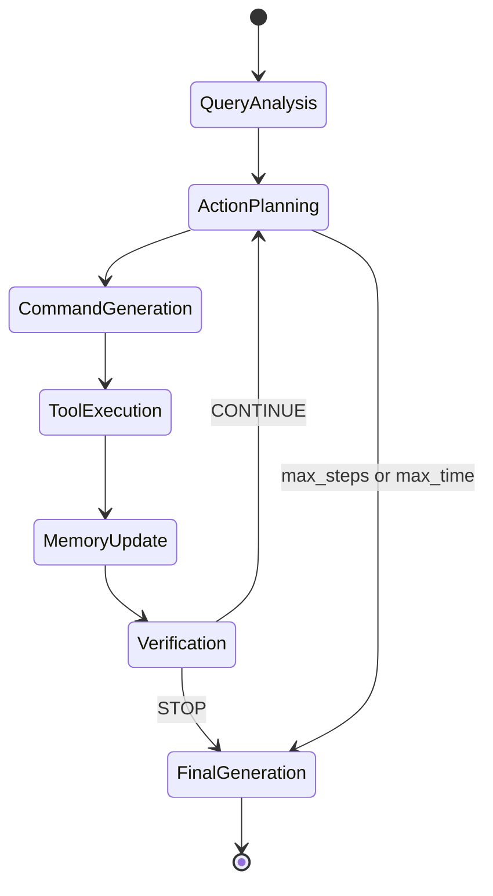
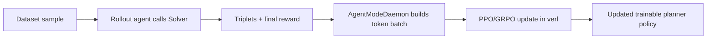

# 02. Orchestration Loop Chi Tiết (kèm mã giả và biểu đồ)

## 1) Sequence tổng thể cho một query

```mermaid
sequenceDiagram
    participant U as User
    participant S as Solver
    participant P as Planner
    participant E as Worker/Executor
    participant V as Verifier
    participant M as Memory
    participant T as Toolbox

    U->>S: query
    S->>P: analyze_query(query)
    P-->>S: query_analysis

    loop step = 1..max_steps
        S->>P: generate_next_step(query, query_analysis, memory)
        P-->>S: context, sub_goal, tool_name

        S->>E: generate_tool_command(context, sub_goal, tool_name)
        E-->>S: command

        S->>E: execute_tool_command(tool_name, command)
        E->>T: tool.execute(...)
        T-->>E: tool_result
        E-->>S: result

        S->>M: add_action(step, tool, sub_goal, command, result)
        S->>V: verificate_context(query, query_analysis, memory)
        V-->>S: STOP or CONTINUE

        alt STOP
            break
        end
    end

    S->>P: generate_final_output / generate_direct_output
    P-->>S: final answer
    S-->>U: answer + trace
```

## 2) State machine của orchestration



## 3) Mã giả inference loop (bám sát `solver.solve`)

```text
INPUT:
  question: str
  image_path: optional str
  params: max_steps, max_time, output_types, max_tokens

STATE:
  memory = {}
  json_data = {query, image}

ALGORITHM:
  set cache dir for executor

  if "base" in output_types:
      base_response = Planner.generate_base_response(...)
      json_data.base_response = base_response
      if output_types == {"base"}:
          return json_data

  query_analysis = Planner.analyze_query(...)
  json_data.query_analysis = query_analysis

  step = 0
  start_time = now()

  while step < max_steps and elapsed(start_time) < max_time:
      step += 1

      next_step = Planner.generate_next_step(question, image, query_analysis, memory, step, max_steps, json_data)
      context, sub_goal, tool_name = Planner.extract_context_subgoal_and_tool(next_step)

      if tool_name invalid:
          command = "N/A"
          result = "tool not found"
      else:
          tc = Executor.generate_tool_command(question, image, context, sub_goal, tool_name, tool_metadata, step, json_data)
          analysis, explanation, command = Executor.extract_explanation_and_command(tc)
          result = Executor.execute_tool_command(tool_name, command)
          json_data["tool_result_" + step] = result

      Memory.add_action(step, tool_name, sub_goal, command, result)

      verify = Verifier.verificate_context(question, image, query_analysis, memory, step, json_data)
      _, conclusion = Verifier.extract_conclusion(verify)
      if conclusion == "STOP":
          break

  if "final" in output_types:
      json_data.final_output = Planner.generate_final_output(question, image, memory)
  if "direct" in output_types:
      json_data.direct_output = Planner.generate_direct_output(question, image, memory)

  return json_data
```

## 4) Input/Output chi tiết theo từng bước loop

### Step 0: Query Analysis
- Input:
  - query, image(optional), tool list, tool metadata
- Output:
  - structured analysis text (skills, relevant tools, considerations)

### Step 1..N-A: Action Planning
- Input:
  - query
  - query_analysis
  - memory actions từ các bước trước
  - step index và số bước còn lại
- Output:
  - `(context, sub_goal, tool_name)`

### Step 1..N-B: Command Generation
- Input:
  - context/sub_goal/tool_name + tool metadata
- Output:
  - Python command với pattern `execution = tool.execute(...)`

### Step 1..N-C: Tool Execution
- Input:
  - tool_name + generated command
- Output:
  - tool results (list) hoặc error message

### Step 1..N-D: Verification
- Input:
  - query + query_analysis + full memory
- Output:
  - stop decision (`STOP`/`CONTINUE`)

### Final: Generation
- Input:
  - query + full memory
- Output:
  - detailed or concise answer

## 5) Training-time orchestration (planner-tuning view)

Khi RL training với `verl`, loop inference ở trên được gọi bên trong rollout.



Điểm quan trọng:
- Nếu chỉ planner là trainable, gradient chủ yếu tối ưu các transition phát sinh từ planner calls.
- Worker/Verifier/Generator fixed đóng vai trò môi trường ổn định tương đối cho planner policy learning.

## 6) Thiết kế loop để tối ưu planning (khuyến nghị nghiên cứu)

1. Giữ Verifier fixed ở giai đoạn đầu để tránh policy non-stationary kép.
2. Ràng buộc Planner output chặt format (`context/sub_goal/tool_name`) để giảm parse failure.
3. Log đầy đủ `json_data` theo step để làm trajectory-level diagnostics.
4. Theo dõi metrics loop-level:
   - step count,
   - tool success rate,
   - verifier stop quality,
   - final correctness.
