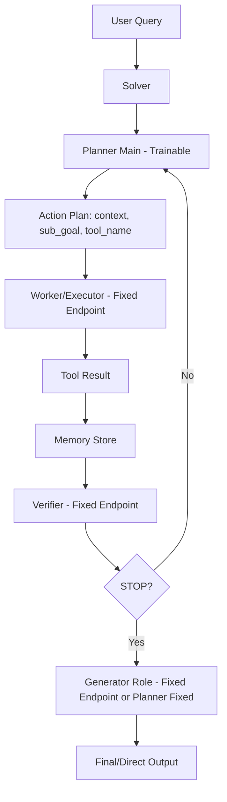

# 05. Experiment Playbook: Thiết kế Sub-Agent + Orchestration cho nghiên cứu

Tài liệu này là “bản thiết kế nghiên cứu” để bạn triển khai, đo lường, và phân tích planner tuning end-to-end.

## 1) Kiến trúc trực quan: sub-agent và luồng dữ liệu



## 2) Interface matrix (method-level)

| Component | Method | Input contract | Output contract | Failure modes |
|---|---|---|---|---|
| Planner | `analyze_query` | query + tools metadata | query analysis text/schema | vague decomposition |
| Planner | `generate_next_step` | query + analysis + memory + step info | `context, sub_goal, tool_name` | wrong tool, missing context |
| Planner | `extract_context_subgoal_and_tool` | next-step response | normalized tuple | parse failure |
| Worker | `generate_tool_command` | context + subgoal + tool metadata | python command | invalid arguments |
| Worker | `execute_tool_command` | tool name + command | execution results | timeout, runtime error |
| Verifier | `verificate_context` | query + analysis + memory | STOP/CONTINUE signal | early stop, late stop |
| Generator | `generate_direct_output` | query + memory | concise answer | hallucinated summary |
| Memory | `add_action/get_actions` | step tuple | structured trajectory | stale/overlong memory |

## 3) Pseudocode: orchestration wrapper theo từng sub-agent

```text
function PlannerStage(query, image, memory, step_idx):
    if step_idx == 0:
        analysis = planner.analyze_query(query, image)
        return {"analysis": analysis}

    next_step = planner.generate_next_step(
        question=query,
        image=image,
        query_analysis=global_analysis,
        memory=memory,
        step_count=step_idx,
        max_step_count=max_steps,
        json_data=trace
    )

    context, sub_goal, tool_name = planner.extract_context_subgoal_and_tool(next_step)
    return {
      "context": context,
      "sub_goal": sub_goal,
      "tool_name": tool_name,
      "raw": next_step
    }
```

```text
function WorkerStage(query, image, planner_action):
    cmd_resp = executor.generate_tool_command(
      question=query,
      image=image,
      context=planner_action.context,
      sub_goal=planner_action.sub_goal,
      tool_name=planner_action.tool_name,
      tool_metadata=toolbox[planner_action.tool_name]
    )

    _, _, command = executor.extract_explanation_and_command(cmd_resp)
    result = executor.execute_tool_command(planner_action.tool_name, command)

    return {"command": command, "result": result}
```

```text
function VerifierStage(query, image, analysis, memory, step_idx):
    verify_resp = verifier.verificate_context(
      question=query,
      image=image,
      query_analysis=analysis,
      memory=memory,
      step_count=step_idx
    )
    _, conclusion = verifier.extract_conclusion(verify_resp)
    return conclusion
```

```text
function GeneratorStage(query, image, memory):
    direct = planner.generate_direct_output(query, image, memory)
    final  = planner.generate_final_output(query, image, memory)
    return {"direct": direct, "final": final}
```

## 4) Experiment design cho PhD-level analysis

## Phase A: System identification
- Mục tiêu: hiểu distribution của step count, tool usage, stop decisions.
- Output bắt buộc:
  - histogram step count,
  - tool confusion matrix,
  - verifier stop profile.

## Phase B: Planner-only RL tuning
- Keep fixed:
  - Worker endpoint,
  - Verifier endpoint,
  - Generator endpoint.
- Tune:
  - Planner main policy.

## Phase C: Robustness and generalization
- cross-domain test (search/math/tool-use)
- shift test (noisy tools / delayed tool responses)
- budget sensitivity (max_steps, timeout)

## 5) Visualization chuẩn cho paper/report

## 5.1 Decision Sankey (khuyến nghị)
- từ query type -> tool sequence -> final correctness.

## 5.2 Stop curve
- tỉ lệ STOP theo step index.
- giúp thấy verifier-induced bias lên planner learning.

## 5.3 Accuracy-Cost frontier
- trục X: cost/latency
- trục Y: correctness
- so sánh baseline vs tuned planner.

## 6) Ablation matrix đề xuất

1. Reward terms:
- `R_answer` only
- `R_answer + R_efficiency`
- full composite reward

2. Planner prompting:
- strict schema vs loose schema
- context length constraints

3. Verifier strictness (fixed model, đổi prompt):
- strict STOP
- conservative CONTINUE

4. Toolset subsets:
- search only
- search + python
- full tools

## 7) Kết luận thực dụng

Nếu mục tiêu khoa học là “tuning planning policy”, bạn nên:
1. giữ các role khác cố định để giảm non-stationarity,
2. log trajectory-level signals đầy đủ,
3. báo cáo planning metrics riêng thay vì chỉ final accuracy,
4. làm ablation theo reward + verifier behavior để chứng minh causal story.
